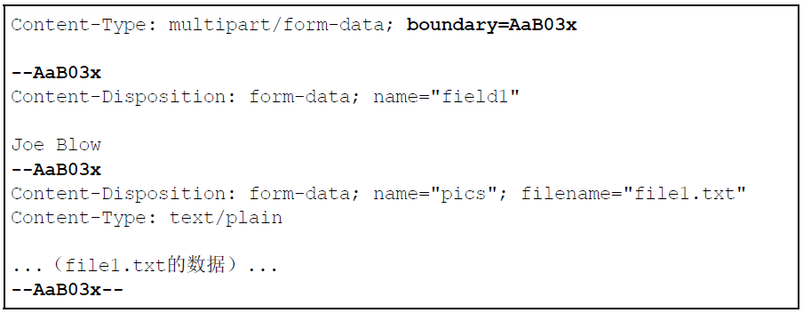

第1章　了解 Web 及网络基础
- 1.3 网络基础 TCP/IP

    通常使用的网络（包括互联网）是在 TCP/IP 协议族的基础上运作的。而 HTTP 属于它内部的一个子集。
    - 1.3.1　TCP/IP 协议族

        TCP/IP 是互联网相关的各类协议集合的总称。
    - 1.3.2　TCP/IP 的分层管理

        TCP/IP 协议族里重要的一点就是分层（自己思考分层的优点）。TCP/IP 协议族按层次分别分为以下 4 层：应用层、传输层、网络层和数据链路层。
        1. 应用层: 决定了向用户提供应用服务时通信的活动。（HTTP、FTP、DNS）
        2. 传输层: 传输层对上层应用层，提供处于网络连接中的两台计算机之间的数据传输。(TCP、UDP)
        3. 网络层: 处理在网络上流动的数据包。数据包是网络传输的最小数据单位。该层规定了通过怎样的路径（所谓的传输路线）到达对方计算机，并把数据包传送给对方。
        4. 链路层: 处理连接网络的硬件部分。包括控制操作系统、硬件的设备驱动、NIC（Network Interface Card，网络适配器，即网卡），及光纤等物理可见部分（还包括连接器等一切传输媒介）。硬件上的范畴均在链路层的作用范围之内。

    - 1.3.3　TCP/IP 通信传输流

        一个例子：客户端在应用层（HTTP 协议）发出一个想看某个 Web 页面的 HTTP 请求。接着，为了传输方便，在传输层（TCP 协议）把从应用层处收到的数据（HTTP 请求报文）进行分割，并在各个报文上打上标记序号及端口号后转发给网络层。在网络层（IP 协议），增加作为通信目的地的 MAC 地址后转发给链路层。这样一来，发往网络的通信请求就准备齐全了。接收端的服务器在链路层接收到数据，按序往上层发送，一直到应用层。当传输到应用层，才能算真正接收到由客户端发送过来的 HTTP请求。
        
        应用层---------->传输层---------->网络层---------->链路层
        （FIXME： 各个层次的封装的名字叫什么）
        发送端在层与层之间传输数据时，每经过一层时必定会被打上一个该层所属的首部信息。反之，接收端在层与层传输数据时，每经过一层时会把对应的首部消去。

- 1.4　与 HTTP 关系密切的协议: IP、TCP和DNS
    - 1.4.1　负责传输的IP协议

        按层次分，IP（Internet Protocol）网际协议位于网络层。几乎所有使用网络的系统都会用到 IP 协议。
        IP 协议的作用是把各种数据包传送给对方。而要保证确实传送到对方那里，则需要满足各类条件。其中两个重要的条件是 IP 地址和 MAC地址（Media Access Control Address）。IP 地址指明了节点被分配到的地址，MAC 地址是指网卡所属的固定地址。IP 地址可以和 MAC 地址进行配对。IP 地址可变换，但 MAC 地址基本上不会更改。

        IP地址-----（ARP协议（地址解析协议））----->MAC地址、 MAC地址-----（RARP协议（反向地址解析协议））----->IP地址
        IP（网际协议）间的通信依赖 MAC 地址。在网络上，通信的双方在同一局域网（LAN）内的情况是很少的，通常是经过多台计算机和网络设备中转才能连接到对方。而在进行中转时，会利用下一站中转设备的MAC地址来搜索下一个中转目标。这时，会采用 ARP 协议（AddressResolution Protocol）。
        （思考：链路层的包带不带上MAC地址？）

    - 1.4.2　确保可靠性的 TCP 协议

        TCP 位于传输层，提供可靠的字节流服务。（所谓的字节流服务（Byte Stream Service）是指，为了方便传输，将大块数据分割成以报文段（segment）为单位的数据包进行管理。而可靠的传输服务是指，能够把数据准确可靠地传给对方。）
        为了准确无误地将数据送达目标处，TCP 协议采用了三次握手（three-way handshaking）策略。用 TCP 协议把数据包送出去后，TCP不会对传送后的情况置之不理，它一定会向对方确认是否成功送达。
        
        握手过程中使用了 TCP 的标志（flag） —— SYN（synchronize） 和ACK（acknowledgement）。
        三次握手过程：发送端首先发送一个带 SYN 标志的数据包给对方。接收端收到后，回传一个带有 SYN/ACK 标志的数据包以示传达确认信息。最后，发送端再回传一个带 ACK 标志的数据包，代表“握手”结束。
        四次挥手过程：发送端首先发送一个带 FIN 标志的数据包给对方。接收端收到后，回传一个带有 ACK 标志的数据包以示传达确认信息。接收端再发送一个带 FIN 标志的数据包给发送端。发送端收到后，回传一个带有 ACK 标志的数据包以示传达确认信息。（思考：为什么要四次挥手？  发送端发送完所有的请求报文，达到目的后，可主动切断客户端-》服务端的信道，但此时服务端可能存在尚未发送完毕的报文，服务端-》客户端的信道暂时不能切换，所以一直维持着直到所有的数据都从返回到客户端，最后服务端发一个带FIN标识的报文到客户端，表示切断服务端-》客户端的信道，客户端最后响应表示已知此事）

- 1.5　负责域名解析的 DNS 服务

    DNS（Domain Name System）协议提供通过域名查找 IP 地址，或逆向从 IP 地址反查域名的服务。

- 1.6　各种协议与 HTTP 协议的关系

    访问www.baidu.com页面:
    1. DNS解析出IP地址                                                      -- 客户端
    2. HTTP生成针对目标Web服务器的HTTP报文（请求报文）                        -- 客户端     
    3. TCP将HTTP报文按序号分割为多个报文段（每个报文段可靠地传给对方）          -- 客户端
    4. IP协议负责搜索对方的地址，边中转边传送                                 -- 路由器
    5. TCP接收到报文段，按照序号重组这些报文段为HTTP报文                       -- 服务端
    6. HTTP处理HTTP报文                                                     -- 服务端
    7. 向客户端发一个响应报文                                                -- 服务端

- 1.7　URI 和 URL

    与 URI（统一资源标识符）相比，我们更熟悉 URL（UniformResource Locator，统一资源定位符）。
    URI 用字符串标识某一互联网资源，而 URL 表示资源的地点（互联网上所处的位置）。可见 URL 是 URI 的子集。

第 2 章　简单的 HTTP 协议
- 2.2　通过请求和响应的交换达成通信

    1. 请求报文是由请求方法、请求 URI、协议版本、可选的请求首部字段和内容实体构成的。
    2. 响应报文基本上由协议版本、状态码（表示请求成功或失败的数字代码）、用以解释状态码的原因短语、可选的响应首部字段以及实体主体构成。

- 2.3　HTTP 是不保存状态的协议
    HTTP协议本身不保留之前一切的请求和响应报文的信息。
    解决无状态的问题：HTTP/1.1 虽然是无状态协议，但为了实现期望的保持状态功能，于是引入了 Cookie 技术。有了 Cookie 再用 HTTP 协议通信，就可以管理状态了
    
- 2.5 告知服务器意图的 HTTP 方法

    方法的作用在于，可以指定请求的资源按期望产生某种行为。方法中有 GET、POST 和 HEAD 等。
    1. GET ：获取资源
    2. POST：传输实体主体
    3. PUT：传输文件
    4. HEAD：获得报文首部
    5. DELETE：删除文件
    6. OPTIONS：询问支持的方法
    7. TRACE：追踪路径
    8. CONNECT：要求用隧道协议连接代理

- 2.7　持久连接节省通信量

    HTTP 协议的初始版本中，每进行一次 HTTP 通信就要断开一次 TCP连接。因此在一个包含多张图片的 HTML 页面的情况下，在发送请求访问 HTML 页面资源的同时，也会请求该 HTML 页面里包含的其他资源。因此，每次的请求都会造成无谓的 TCP 连接建立和断开，增加通信量的开销。
    - 2.7.1　持久连接
        为了解决频繁请求造成无谓的TCP连接建立和断开。HTTP/1.1 和一部分的 HTTP/1.0 想出了持久连接（HTTP Persistent Connections，也称为 HTTP keep-alive 或HTTP connection reuse）的方法。
        持久连接的好处在于减少了 TCP 连接的重复建立和断开所造成的额外开销，减轻了服务器端的负载。另外，减少开销的那部分时间，使HTTP 请求和响应能够更早地结束，这样 Web 页面的显示速度也就相应提高了。

    - 2.7.2　管线化
        持久连接使得多数请求以管线化（pipelining）方式发送成为可能。从前发送请求后需等待并收到响应，才能发送下一个请求。管线化技术出现后，不用等待响应亦可直接发送下一个请求。
        限制： 1、只有GET和HEAD要求可以进行管线化，而POST则有所限制。2、初次创建连接时也不应启动管线机制，因为对方（服务器）不一定支持HTTP/1.1版本的协议。3、HTTP1.1要求服务器端支持管线化，但并不要求服务器端也对响应进行管线化处理，只是要求对于管线化的请求不失败，而且现在很多服务器端和代理程序对管线化的支持并不好，现代浏览器Chrome和Firefox默认并未开启管线化支持。

    
- 2.8　使用 Cookie 的状态管理

    HTTP 是无状态协议，它不对之前发生过的请求和响应的状态进行管理。也就是说，无法根据之前的状态进行本次的请求处理。
    
    不可否认，无状态协议当然也有它的优点。由于不必保存状态，自然可减少服务器的 CPU 及内存资源的消耗。从另一侧面来说，也正是因为 HTTP 协议本身是非常简单的，所以才会被应用在各种场景里。

    Cookie 技术通过在请求和响应报文中写入 Cookie 信息来控制客户端的状态。Cookie 会根据从服务器端发送的响应报文内的一个叫做 Set-Cookie 的首部字段信息，通知客户端保存 Cookie。当下次客户端再往该服务器发送请求时，客户端会自动在请求报文中加入 Cookie 值后发送出去。服务器端发现客户端发送过来的 Cookie 后，会去检查究竟是从哪一个客户端发来的连接请求，然后对比服务器上的记录，最后得到之前的状态信息。

第 3 章　HTTP 报文内的 HTTP信息
- 3.1　HTTP 报文

    用于 HTTP 协议交互的信息被称为 HTTP 报文。请求端（客户端）的HTTP 报文叫做请求报文，响应端（服务器端）的叫做响应报文。HTTP 报文本身是由多行（用 CR+LF 作换行符）数据构成的字符串文本。

- 3.2　请求报文及响应报文的结构
    1. 报文首部        服务器或客户端处理的请求或者响应的内容以及属性
        - 请求行            包含用于请求的方法，请求 URI 和 HTTP 版本。
        - 状态行            包含表明响应结果的状态码，原因短语和 HTTP 版本。
        - 首部字段          包含表示请求和响应的各种条件和属性的各类首部。一般是通用首部、请求首部、响应首部和实体首部。

    2. CR+LF

    3. 报文主体        应被发送的内容
       

- 3.3　编码提升传输速率
    - 3.3.1　报文主体和实体主体的差异
        1. 报文（message）          是 HTTP 通信中的基本单位，由 8 位组字节流（octet sequence，其中 octet 为 8 个比特）组成，通过 HTTP 通信传输。
        2. 实体（entity）           作为请求或响应的有效载荷数据（补充项）被传输，其内容由实体首部和实体主体组成。
    
    HTTP 报文的主体用于传输请求或响应的实体主体。通常，报文主体等于实体主体。只有当传输中进行编码操作时，实体主体的内容发生变化，才导致它和报文主体产生差异。

    - 3.3.2　压缩传输的内容编码

        内容编码指明应用在实体内容上的编码格式，并保持实体信息原样压缩。内容编码后的实体由客户端接收并负责解码。
        1. gzip（GNU zip）
        2. compress（UNIX 系统的标准压缩）
        3. deflate（zlib）
        4. identity（不进行编码）  

    - 3.3.3　分割发送的分块传输编码

        把实体主体分块的功能称为分块传输编码（Chunked Transfer Coding）。分块传输编码会将实体主体分成多个部分（块）。每一块都会用十六进制来标记块的大小，而实体主体的最后一块会使用“0(CR+LF)”来标记。使用分块传输编码的实体主体会由接收的客户端负责解码，恢复到编码前的实体主体。

- 3.4　发送多种数据的多部分对象集合

    MIME（Multipurpose Internet Mail Extensions，多用途因特网邮件扩展）机制，它允许邮件处理文本、图片、视频等多个不同类型的数据。例如，图片等二进制数据以 ASCII 码字符串编码的方式指明，就是利用 MIME 来描述标记数据类型。而在 MIME 扩展中会使用一种称为多部分对象集合（Multipart）的方法，来容纳多份不同类型的数据。

    HTTP 协议中也采纳了多部分对象集合（在首部字段里加上Content-type），发送的一份报文主体内可含有多类型实体。通常是在图片或文本文件等上传时使用。
    1. multipart/form-data              在 Web 表单文件上传时使用
    2. multipart/byteranges             状态码 206（Partial Content，部分内容）响应报文包含了多个范围的内容时使用。

    
    boundary 字符串用于划分多部分对象集合指明的各类实体。在 boundary 字符串指定的各个实体的起始行之前插入“--”标记（例如：--AaB03x），而在多部分对象集合对应的字符串的最后插入“--”标记（例如：--AaB03x--)。多部分对象集合的每个部分类型中，都可以含有首部字段。另外，可以在某个部分中嵌套使用多部分对象集合

- 3.5　获取部分内容的范围请求（Range Request）

    执行范围请求时，会用到首部字段 Range 来指定资源的 byte 范围。
    1. Range: bytes=5001-10000
    2. Range: bytes=5001-
    3. Range: bytes=-3000, 5000-7000

    
- 3.6　内容协商返回最合适的内容

    内容协商机制是指客户端和服务器端就响应的资源内容进行交涉，然后提供给客户端最为适合的资源。内容协商会以响应资源的语言、字符集、编码方式等作为判断的基准。(Accept、Accept-Charset、Accept-Encoding、Accept-Language、Content-Language)

    内容协商技术：
    1. 服务器驱动协商（Server-driven Negotiation）          由服务器端进行内容协商。以请求的首部字段为参考，在服务器端自动处理。
    2. 客户端驱动协商（Agent-driven Negotiation）           用户从浏览器显示的可选项列表中手动选择。还可以利用 JavaScript 脚本在 Web 页面上自动进行上述选择。比如按 OS 的类型或浏览器类型，自行切换成 PC 版页面或手机版页面。
    3. 透明协商（Transparent Negotiation）                  是服务器驱动和客户端驱动的结合体，是由服务器端和客户端各自进行内容协商的一种方法。

第 4 章　返回结果的 HTTP 状态码

- 4.1　状态码告知从服务器端返回的请求结果
    
    1. 1XX     Informational（信息性状态码）           接收的请求正在处理
    2. 2XX     Success（成功状态码）                   请求正常处理完毕
    3. 3XX     Redirection（重定向状态码）             需要进行附加操作以完成请求
    4. 4XX     Client Error（客户端错误状态码）        服务器无法处理请求
    5. 5XX     Server Error（服务器错误状态码）        服务器处理请求出错

第 5 章　与 HTTP 协作的 Web 服务器

一台 Web 服务器可搭建多个独立域名的 Web 网站，也可作为通信路径上的中转服务器提升传输效率。

在相同的 IP 地址下，由于虚拟主机可以寄存多个不同主机名和域名的 Web 网站，因此在发送 HTTP 请求时，必须在 Host 首部内完整指定主机名或域名的 URI。

- 5.2　通信数据转发程序 ：代理、网关、隧道

    HTTP 通信时，除客户端和服务器以外，还有一些用于通信数据转发的应用程序，例如代理、网关和隧道。它们可以配合服务器工作。这些应用程序和服务器可以将请求转发给通信线路上的下一站服务器，并且能接收从那台服务器发送的响应再转发给客户端。

    1. 代理      代理是一种有转发功能的应用程序，它扮演了位于服务器和客户端“中间人”的角色，接收由客户端发送的请求并转发给服务器，同时也接收服务器返回的响应并转发给客户端。(每通过代理服务器转发请求或响应时，会追加写入 Via 首部信息（Via 是为了追踪客户端与服务器之间的请求和响应报文的传输路径。）)
        - 使用代理服务器的优点：利用缓存技术减少网络带宽的流量，组织内部针对特定网站的访问控制，以获取访问日志为主要目的，等等。
        - 使用方法，按两种基准分类。一种是是否使用缓存，另一种是是否会修改报文。
            1. 缓存代理：预先将资源副本缓存到代理服务器上，当再次接收到相同资源请求时候，将缓存资源作为响应返回。
            2. 透明代理：不对报文做任何加工处理。

    2. 网关      网关是转发其他服务器通信数据的服务器，接收从客户端发送来的请求时，它就像自己拥有资源的源服务器一样对请求进行处理。有时客户端可能都不会察觉，自己的通信目标是一个网关。
    3. 隧道      隧道是在相隔甚远的客户端和服务器两者之间进行中转，并保持双方通信连接的应用程序。

            
    - 5.2.2　网关

        网关的工作机制和代理十分相似。而网关能使通信线路上的服务器提供非 HTTP 协议服务。（利用网关可以将HTTP协议请求转为其他协议通信）。
        利用网关能提高通信的安全性，因为可以在客户端与网关之间的通信线路上加密以确保连接的安全。比如，网关可以连接数据库，使用SQL 语句查询数据。另外，在 Web 购物网站上进行信用卡结算时，网关可以和信用卡结算系统联动。

    - 5.2.3　隧道

        隧道可按要求建立起一条与其他服务器的通信线路，可使用 SSL 等加密手段进行通信。隧道的目的是确保客户端能与服务器进行安全的通信，请求的会保持原样转给之后的服务器，等到通信断开隧道才会结束。
        

- 5.3　保存资源的缓存
    
    缓存是指代理服务器或客户端本地磁盘内保存的资源副本。利用缓存客户端可就近从缓存服务器上获取资源，减少对源服务器的访问，省时省流量，避免多次从源服务器转发资源。值得注意的是，缓存的存在有效性的，会存在客户端的要求、缓存的有效期等因素，缓存服务器会向源服务器确认资源的有效性。缓存失效则会重新向源服务器拉取新的资源。（注意POST等部分方法的是不会做缓存的）。

    客户端也可以做缓存，存在客户端的浏览器中（临时网络文件（Temporary Internet File），同样存在缓存的有效性的问题）。

第 6 章　HTTP 首部

请求报文首部：

        请求行--》请求方法、URI、HTTP版本

        请求首部字段、通用首部字段、实体首部字段--》HTTP首部字段

        其他

响应报文首部：

        状态行--》HTTP版本、状态码

        响应首部字段、通用首部字段、实体首部字段--》HTTP首部字段

        其他

HTTP首部字段比较丰富，在客户端与服务器之间以 HTTP 协议进行通信的过程中，无论是请求还是响应都会使用首部字段，它能起到传递额外重要信息的作用。

结构：由首部字段名和字段值构成的，中间用冒号“:” 分隔。（如：authority: www.google.com）

Content-Type: text/html------报文主体的 对象类型。
Cookie: 

- HTTP 首部字段类型：
    1. 通用首部字段（General Header Fields）
    2. 请求首部字段（Request Header Fields）
    3. 响应首部字段（Response Header Fields）
    4. 实体首部字段（Entity Header Fields）

- 6.7　为 Cookie 服务的首部字段

    Cookie负责管理服务器与客户端之间状态，Cookie 的工作机制是用户识别及状态管理。Web 网站为了管理用户的状态会通过 Web 浏览器，把一些数据临时写入用户的计算机内。接着当用户访问该Web网站时，可通过通信方式取回之前发放的Cookie。

    Cookie的安全问题：

    Cookie数据的大小：

第 7 章　确保 Web 安全的HTTPS

- 在 HTTP 协议中有可能存在信息窃听或身份伪装等安全问题。使用HTTPS 通信机制可以有效地防止这些问题
    - HTTP协议的缺点：
        1. 通信使用明文（不加密），内容可能会被窃听
            - HTTP不提供加密功能，也无法做到对通信整体（使用 HTTP 协议通信的请求和响应的内容）进行加密
            - 按TCP/IP 协议族的工作机制，通信内容在所有的通信线路上都有可能遭到窥视。
            - 解决方法： 可通过和SSL（Secure Socket Layer，安全套接层）或TLS（Transport Layer Security，安全层传输协议）的组合使用，加密 HTTP 的通信内容。这种组合也叫HTTPS
        2. 不验证通信方的身份，因此有可能遭遇伪装
            - HTTP 协议中的请求和响应不会对通信方进行确认。(DoS攻击（Denial of Service，拒绝服务攻击）)
            - 解决方法：SSL不仅提供加密处理，还提供了证书手段，用于确定通信方
                - 证书来源：值得信赖的第三方机构（CA），可证明服务器和客户端是实际存在的。
        3. 无法证明报文的完整性，所以有可能已遭篡改                     
            - 虽然有使用 HTTP 协议确定报文完整性的方法，但事实上并不便捷、可靠。HTTP协议常用的是 MD5 和 SHA-1 等散列值校验的方法，以及用来确认文件的数字签名方法。但需要客户端亲自验证下载的文件MD5，且MD5本身也有可能被改写.
            - 解决方法：使用HTTPS，SSL 提供认证和加密处理及摘要功能。

- 7.2　HTTP+ 加密 + 认证 + 完整性保护=HTTPS
    - 7.2.1　HTTP 加上加密处理和认证以及完整性保护后即是HTTPS
    
    - 7.2.2　HTTPS 是身披 SSL 外壳的 HTTP
        
        HTTPS不是新的协议只是 HTTP `通信接口部分`用SSL（Secure Socket Layer）和 TLS（Transport Layer Security）协议代替而已。通常，HTTP 直接和 TCP 通信。当使用 SSL 时，则演变成先和 SSL 通信，再由 SSL 和 TCP 通信了。简言之，所谓 HTTPS，其实就是身披SSL 协议这层外壳的 HTTP。
        (HTTP -> SSL -> TCP -> IP -> 链路) 

    
    - 7.2.3　相互交换密钥的公开密钥加密技术

        - SSL使用公开密钥加密（Public-key cryptography）的加密处理方式。

        公开密钥加密使用一对非对称的密钥。一把叫做私有密钥（private key），另一把叫做公开密钥（public key）。顾名思义，私有密钥不能让其他任何人知道，而公开密钥则可以随意发布，任何人都可以获得。

       - HTTPS 采用共享密钥加密和公开密钥加密两者并用的混合加密机制

        流程：客户端获取服务器的公钥，客户端将一个共享密钥通过公钥加密发送给服务器，服务器通过私钥解密获得共享密钥，开始使用共享密钥加密数据相互通信。

    - 7.2.4　证明公开密钥正确性的证书
        当打算与某台服务器建立公开密钥加密的通信时，如何证明收到的公开密钥就是原本预想的那台服务器发行的公开密钥？为了解决这个问题，可以`使用由数字证书认证机构（CA，Certificate Authority）和其相关机关颁发的公开密钥证书`。
        
        - 数字证书认证机构的业务流程 :
            
            1. 首先，服务器的运营人员向数字证书认证机构提出公开密钥的申请。数字证书认证机构在判明提出申请者的身份之后，会`对已申请的公开密钥做数字签名`，然后分配这个已签名的公开密钥，并`将该公开密钥放入公钥证书后绑定在一起`。
            
            2. 服务器会将这份由数字证书认证机构颁发的公钥证书发送给客户端以进行公开密钥加密方式通信。`公钥证书`也可叫做数字证书或直接称为证书。

            3. 接到证书的客户端可使用数字证书认证机构的公开密钥，对那张证书上的数字签名进行`验证`(验证流程如下)，一旦验证通过，客户端便可明确两件事：一，认证服务器的公开密钥的是真实有效的数字证书认证机构。二，服务器的公开密钥是值得信赖的。
                1. 客户端取出提前`内置`在事先内置(如浏览器)的认证机构的公钥
                2. 用认证机构的公钥去解密公钥证书里的数字签名 从而得到数字指纹
                3. 客户端对公钥证书的服务器公钥进行 数字摘要算法 从而生成数字指纹
                4. 对比客户端自己生成的数字指纹(第3步)和解密得到的数字指纹(第2步)是否一致 如果一致则公钥证书验证通过

        - 可证明认证结构组织真实性的 EV SSL 证书
            
            EV SSL（（Extended Validation SSL Certificate））证书可以证明通信方是否规范，也可以用于确定对方服务器背后运行的企业是否真实存在。

        - 用于确认客户端的客户端证书

            HTTPS 中还可以使用客户端证书。以客户端证书进行客户端认证，证明服务器正在通信的对方始终是预料之内的客户端，其作用跟服务器证书如出一辙。（如：网上银行，登录网银时不仅要求用户确认输入 ID 和密码，还会要求用户的客户端证书，以确认用户是否从特定的终端访问网银）

        - 自签名证书

            如果使用 OpenSSL 这套开源程序，每个人都可以构建一套属于自己的认证机构，从而自己给自己颁发服务器证书。
            
            独立构建的认证机构叫做自认证机构，由自认证机构颁发的“无用”证书也被戏称为自签名证书。

            浏览器访问该服务器时，会显示“无法确认连接安全性”或“该网站的安全证书存在问题”等警告消息。

    - 7.2.5　HTTPS 的安全通信机制

        - HTTPS 通信流程：
            1. 客户端通过发送 Client Hello 报文开始 SSL 通信。报文中包含客户端支持的 `SSL 的指定版本`、`加密组件（Cipher Suite）列表`（所使用的加密算法及密钥长度等）。
            2. 服务器可进行 SSL 通信时，会以 Server Hello 报文作为应答。和客户端一样，在报文中包含 `SSL 版本`以及`加密组件`。服务器的加密组件内容是从接收到的客户端加密组件内筛选出来的。
            3. 之后服务器发送 Certificate 报文。报文中包含`公开密钥证书`。
            4. 最后服务器发送 Server Hello Done 报文通知客户端，最初阶段的 SSL 握手协商部分结束。
            5. SSL 第一次握手结束之后，客户端以 Client Key Exchange 报文作为回应。报文中包含通信加密中使用的一种被称为 Pre-master secret 的随机密码串(也就是共享密钥)。该报文已用步骤 3 中的公开密钥进行加密。
            6. 接着客户端继续发送 Change Cipher Spec 报文。该报文会提示服务器，在此报文之后的通信会采用 Pre-master secret 密钥加密。
            7. 客户端发送 Finished 报文。该报文包含连接至今全部报文的整体校验值。这次握手协商是否能够成功，要以服务器是否能够正确解密该报文作为判定标准。
            8. 服务器同样发送 Change Cipher Spec 报文。
            9. 服务器同样发送 Finished 报文。
            10. 服务器和客户端的 Finished 报文交换完毕之后，SSL 连接就算建立完成。当然，通信会受到 SSL 的保护。从此处开始进行应用层协议的通信，即发送 HTTP 请求。
            11. 应用层协议通信，即发送 HTTP 响应。最后由客户端断开连接。断开连接时，发送 close_notify 报文。
            12. 双方互相再发送 TCP FIN 报文来关闭与 TCP的通信。

            上述的流程中，应用层发送数据时会附加一种叫做 MAC（Message Authentication Code）的报文摘要。MAC 能够查知报文是否遭到篡改，从而保护报文的完整性。

        - SSL 和 TLS

            HTTPS 使用 SSL（Secure Socket Layer） 和 TLS（Transport LayerSecurity）这两个协议。TSL 是以 SSL 为原型开发的协议，有时会统一称该协议为 SSL。

        - SSL 速度问题

            SSL 的慢分两种。一种是指通信慢。另一种是指由于大量消耗CPU（加密解密计算部分） 及内存等资源，导致处理速度变慢。
            
            和使用 HTTP 相比，网络负载可能会变慢 2 到 100 倍。除去和TCP 连接、发送 HTTP 请求 • 响应以外，还必须进行 SSL 通信，因此整体上处理通信量不可避免会增加。

            另一点是 SSL 必须进行加密处理。在服务器和客户端都需要进行加密和解密的运算处理。因此从结果上讲，比起 HTTP 会更多地消耗服务器和客户端的硬件资源，导致负载增强。

            一种解决方式是使用SSL加速器（专用服务器）硬件改善问题。提高数倍SSL计算速度。

        - 什么时候使用HTTPS

            只有在包含个人信息等敏感数据时，才利用 HTTPS 加密通信。

    
第 8 章　确认访问用户身份的认证
    
- 用户核对信息
    - 密码：只有本人才会知道的字符串信息。
    - 动态令牌：仅限本人持有的设备内显示的一次性密码。
    - 数字证书：仅限本人（终端）持有的信息。
    - 生物认证：指纹和虹膜等本人的生理信息。
    - IC 卡等：仅限本人持有的信息。

- 8.5.2　Session 管理及 Cookie 应用
    
    - 具体来说cookie机制采用的是在客户端保持状态的方案，而session机制采用的是在服务器端保持状态的方案。

    - 使用 Cookie 来管理 Session，以弥补 HTTP 协议中不存在的状态管理功能：
        1. 客户端把用户 ID 和密码等登录信息放入报文的实体部分，通常是以 POST 方法把请求发送给服务器。而这时，会使用 HTTPS通信来进行 HTML 表单画面的显示和用户输入数据的发送。
        2. 服务器会发放用以识别用户的 Session ID。通过验证从客户端发送过来的登录信息进行身份认证，然后把用户的认证状态与 Session ID 绑定后记录在服务器端。
        3. 客户端接收到从服务器端发来。的 Session ID 后，会将其作为Cookie 保存在本地。下次向服务器发送请求时，浏览器会自动发送Cookie，所以 Session ID 也随之发送到服务器。服务器端可通过验证接收到的 Session ID 识别用户和其认证状态。
        
    
- 为什么给密码加盐（salt）

    salt 其实就是由服务器随机生成的一个字符串，但是要保证长度足够长，并且是真正随机生成的。然后把它和密码字符串相连接（前后都可以）生成散列值。当两个用户使用了同一个密码时，由于随机生成的 salt 值不同，对应的散列值也将是不同的。这样一来，很大程度上减少了密码特征，攻击者也就很难利用自己手中的密码特征库进行破解。
    
    - 注意salt的保存形式：
        1. 每一个用户的salt应该不同 
        2. salt是以明文的形式存储在数据表中的，所以并不能增强密码的安全性

第 9 章　基于 HTTP 的功能追加协议

- 9.2　消除 HTTP 瓶颈的 SPDY
    - 9.2.1　HTTP 的瓶颈
        1. 一条连接上只可发送一个请求。
        2. 请求只能从客户端开始。客户端不可以接收除响应以外的指令。
        3. 请求 / 响应首部未经压缩就发送。首部信息越多延迟越大。
        4. 发送冗长的首部。每次互相发送相同的首部造成的浪费较多。
        5. 可任意选择数据压缩格式。非强制压缩发送。

    
    - 9.2.2　SPDY 的设计与功能

        - SPDY 没有完全改写 HTTP 协议，而是在 TCP/IP 的应用层与运输层之间通过`新加会话层`的形式运作。同时，考虑到安全性问题，SPDY 规定通信中使用 SSL。

        - SPDY 以会话层的形式加入，控制对数据的流动，但还是采用 HTTP建立通信连接。因此，可照常使用 HTTP 的 GET 和 POST 等方法、Cookie 以及 HTTP 报文等。
        
            HTTP -> SPDY(会话层) -> SSL（表示层） -> TCP -> IP

        - SPDY提供HTTP 协议的功能：
            1. 多路复用流（通过单一的 TCP 连接，可以无限制处理多个 HTTP 请求。所有请求的处理都在一条 TCP 连接上完成，因此 TCP 的处理效率得到提高。）
            2. 赋予请求优先级（无限制地并发处理请求，还可以给请求逐个分配优先级顺序，在多并发时能解决带宽低而导致的响应慢的问题）
            3. 压缩 HTTP 首部（压缩 HTTP 请求和响应的首部，通信产生的数据包数量和发送的字节数就更少）
            4. 推送功能（支持服务器主动向客户端推送数据的功能。这样，服务器可直接发送数据，而不必等待客户端的请求。）
            5. 服务器提示功能（服务器可以主动提示客户端请求所需的资源。由于在客户端发现资源之前就可以获知资源的存在，因此在资源已缓存等情况下，可以避免发送不必要的请求。）

        - 缺点：

            因为 SPDY 基本上只是将单个域名（ IP 地址）的通信多路复用，所以当一个 Web 网站上使用多个域名下的资源，改善效果就会受到限制。

- 9.3　使用浏览器进行全双工通信的WebSocket
    - 9.3.2　WebSocket 协议
    
    一旦 Web 服务器与客户端之间建立起 WebSocket 协议的通信连接，之后所有的通信都依靠这个专用协议进行。通信过程中可互相发送JSON、XML、HTML 或图片等任意格式的数据。

    - WebSocket特点(基于HTTP：TCP)
        1. 推送功能 (支持由服务器向客户端推送数据的推送功能。这样，服务器可直接发送数据，而不必等待客户端的请求。)
        2. 减少通信量   (只要建立起 WebSocket 连接，就希望一直保持连接状态。和 HTTP 相比，不但每次连接时的总开销减少，而且由于 WebSocket 的首部信息很小，通信量也相应减少了。)
        
        注意成功握手确立 WebSocket 连接之后，通信时不再使用 HTTP 的数据帧，而采用 WebSocket 独立的数据帧。

