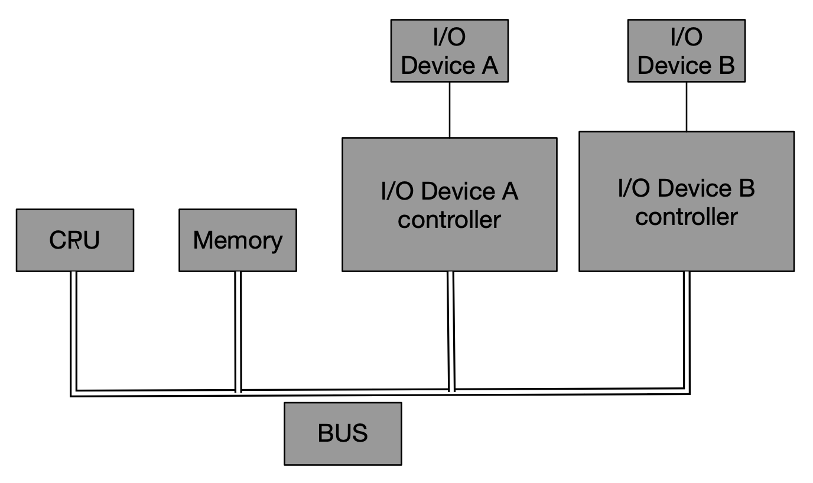

第一章: 温故知新
- 1.1 问题
    1. 程序为什么被编译器编译后才能运行？
    2. 编译器把C语言程序转换为可以执行的机器码的过程做了什么？怎么做？
    3. 最后编译出来的可执行程序文件里面是什么？除了机器码还有什么？它们是怎么存放的，怎么组织的？
    4. #include<stdio.h>是什么意思？吧stdio.h包含进来意味着什么？C语言库又是什么？它怎么实现的？
    5. 不同的编译器和不同的硬件平台以及不同的操作系统，最终编译出来的结果一样吗？为什么？
    6. 程序是怎么运行起来的？操作系统是怎么装载它的？它从哪儿开始执行，到哪儿结束？main函数之前发生了什么？main函数之后又发生了什么？
    7. 如果没有操作系统是否可以运行程序？如果一台没有操作系统的机器运行程序需要什么？怎么实现？
    8. printf是怎么实现？它为什么可以有不定量的参数？为什么可以在终端中输出字符串？
    9. 程序在运行时，在内存中是怎样的？

- 1.2 万变不离其宗

    I/O设备：如显示设备、键盘、软盘和磁盘等，为了协调I/O设备与总线之间的速度，也为了能够让CPU能够与之进行通信，一般每个IO设备都会有一个相应的IO控制器。
    

