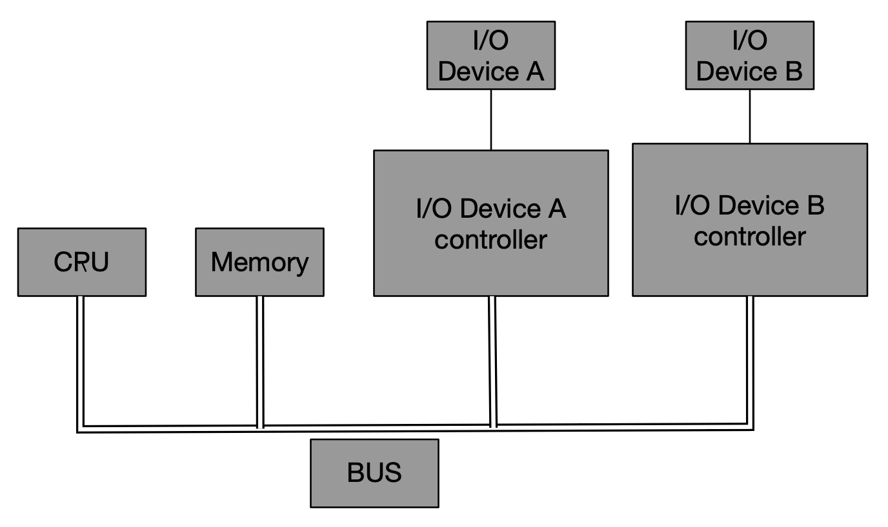

第一章: 温故知新
- 1.1 问题
    1. 程序为什么被编译器编译后才能运行？
    2. 编译器把C语言程序转换为可以执行的机器码的过程做了什么？怎么做？
    3. 最后编译出来的可执行程序文件里面是什么？除了机器码还有什么？它们是怎么存放的，怎么组织的？
    4. #include<stdio.h>是什么意思？吧stdio.h包含进来意味着什么？C语言库又是什么？它怎么实现的？
    5. 不同的编译器和不同的硬件平台以及不同的操作系统，最终编译出来的结果一样吗？为什么？
    6. 程序是怎么运行起来的？操作系统是怎么装载它的？它从哪儿开始执行，到哪儿结束？main函数之前发生了什么？main函数之后又发生了什么？
    7. 如果没有操作系统是否可以运行程序？如果一台没有操作系统的机器运行程序需要什么？怎么实现？
    8. printf是怎么实现？它为什么可以有不定量的参数？为什么可以在终端中输出字符串？
    9. 程序在运行时，在内存中是怎样的？

- 1.2 万变不离其宗

    I/O设备：如显示设备、键盘、软盘和磁盘等，为了协调I/O设备与总线之间的速度，也为了能够让CPU能够与之进行通信，一般每个IO设备都会有一个相应的IO控制器。
    

    后来CPU核心频率提升，导致内存跟不上CPU的速度，于是产生了与内存频率一致的系统总线，而CPU使用倍频（CPU主频的计算方式变为：主频 = 外频 x 倍频。也就是倍频是指CPU和系统总线之间相差的倍数，当外频不变时，提高倍频，CPU主频也就越高。）的方式与系统总线进行通信。随着图形操作界面的普及，图形芯片与CPU和内容之间的数据交换需求越来越大，慢速的I/O设备无法满足图形设备的巨大需求。

    `北桥`：为了处理图形芯片跟CPU和内存之间的`大量交换数据`，协调CPU、内存和高速的图形设备，专门设计了一个高速的北桥芯片（Northbridge， PCI Bridge），以便它们之间能够高速地交换数据。

    `南桥`：由于北桥速度非常高，所有`相对低速的（IO）设备`如果全都直接连接在北桥，那么北桥就既要处理高速设备，又要处理低速设备，设计就会非常复杂。所以又设计了专门处理低速设备的南桥芯片（Southbridge），磁盘、USB、键盘、鼠标等设备都连接在南桥上，由南桥将它们汇总后连接到北桥上。

    - SMP与多核

    由于人们在制造CPU的工艺已经达到了物理天花板极限，在频率上短期暂时无提高的余地，于是多核心便暂时另一个成为提高CPU速度的办法。多CPU，最常见的一种形式就是对称多处理器（Symmetrical Mutli-Processing），简单而言就是每个CPU在系统中所处的地位和所发挥的功能都是一样的，是相互对称的。
    
    由于多处理器的成本高昂，于是处理器的厂商开始考虑将多个处理器“合并在一起打包出售”，这些“被打包”的处理器之间`共享比较昂贵的缓存部件`，只保留多个核心，并且以一个处理器的外包装进行出售，售价仅比单核心处理器贵一点，这就是多核心处理器（Multi-core Processer）的基本想法。实际上就是SMP的简化版，当然，在细节上还是有点差别的，但对逻辑上看它们是完全相同的。

- 1.3 站得高，望得远

    - 系统软件：
        1. 平台性的，如操作系统内核、驱动程序、运行库和数以千计的系统工具 
        2. 用于程序开发的，如编辑器、换边其、连接器等开发工具和开发库

    - 计算机软件体系结构
       
        

        - 每层之间通信的协议，一般称之为接口，接口应当被精心设计，尽量保持稳定不变。除了硬件和应用程序，其他都是所谓的中间层，每个中间层都是对它下面的那层的包装和扩展。

        - 虚拟机技术就是在硬件和操作系统之间增加了一层虚拟层，使得一个计算机上可同时运行多个操作系统，这也是层次结构带来的好处，所以尽可能在少改变甚至不改变其他层的情况下，新增一个层次就可以提供前所未有的功能。

        - 应用程序和开发工具使用到的`应用程序编程接口（Application Programming Interface）`的提供者是运行库，什么运行库提供什么样的API，如Linux下的Glibc库提供的POSIX的API、Windows的运行库提供Windows API，最常见的32位Windows提供的API又被称为Win32.

        运行库使用操作系统提供的`系统调用接口（System call interface）`，系统调用接口实际上往往以`软件中断（Software Interrupt）`，的方式提供，如Linux使用0x80号中断作为系统调用窗口，早期的Windows使用0x2E号作为系统调用接口。

        操作系统内核层对于硬件层来说是硬件接口的使用者，而硬件是接口的定义者。硬件接口的定义决定了操作系统内核，具体来说就是驱动程序如何操作硬件，如何与硬件进行通信。这种接口往往被称为`硬件规格（Hardware Specification）`。硬件生产厂商负责提供硬件规格，操作系统和驱动程序的开发者通过阅读硬件规格文档规定的硬件编程接口标准来编写操作系统和驱动程序。

- 1.4 操作系统做了什么

    - 操作系统的功能
        1. 提供抽象的接口
        2. 管理硬件资源

    - 1.4.1 不要让CPU打盹

        早期CPU资源昂贵，如果一个CPU仅运行一个程序，当程序暂时无须使用CPU时，如读写磁盘等，CPU空闲下来了，造成浪费。有人编写了一个监控程序，用于监控某个程序暂时无须使用CPU时，监控程序就把其他正在等待CPU资源的程序启动起来，使得CPU能够充分地使用。这种被称为`多道程序（Multiprogramming）`,不过这种原始的多道程序技术在程序之间的调度策略比较粗糙，对于程序使用的优先级不敏感，对急需CPU来完成一些重要任务的程序来说，可能很长时间后才能被分配到CPU。

        经过改进后，程序的运行模式变成了一种协作的模式，即每个程序运行一段时间后都主动让出CPU给其他程序，使得一段时间内每个程序都有机会运行一小段时间。这种协作模式也叫`分时系统（Time-Sharing System）`。但如果某程序进行一个很耗时的操作，一直占用CPU，那么其他程序也只有等着，而操作系统整个看上去好像死机一样。分时系统仅适用于当时比较低端的应用和交互环境。

        `多任务（Multi-tasking）系统`选择接管了所有的硬件资源，并且自身运行于一个受硬件保护的级别，而应用程序以进程（Process）的方式运行在比操作系统权限更低的级别，每个进程都有独立的地址空间，使进程间的地址空间互相隔离。CPU由操作系统分配，而进程根据进程优先级都有机会获取到CPU使用权。如果程序运行超出一定时间，操作系统会暂停该进程，将CPU分配给其他应用。这种`抢占式（Preemptive）`的分配方式使操作系统能强行将CPU分配给当前最需要的程序。

    - 1.4.2 设备驱动 

        操作系统将硬件抽象为一系列的概念。（UNIX中，硬件设备的访问形式与方位普通文件一样；在Windows系统中，图形硬件被抽象为GDI，声音和多媒体设备抽象为DirectX对象；磁盘被抽象为普通文件系统）。而这些硬件细节都有操作系统的`硬件驱动（Device Driver）程序`处理。驱动程序可看作操作系统的一部分，与操作系统内核一起运行在特权级。

        文件系统是操作系统最为重要的组成部分。在文件的提取中，文件系统管理磁盘中文件的存储方式。文件系统负责保存文件的存储结构，负责维护这些数据结构并保证磁盘中扇区能有效地组织和利用。

        （现代硬盘普遍使用`LBA(logic Block Address)`方式，整个硬盘中所有的扇区从0开始编号，直到最后一个扇区，这些编号也叫做逻辑扇区号。我们给出一个逻辑扇区号时，硬盘的电子设备会将其转成实际的盘面、磁道等位置。）

    
- 1.5 内存不够怎么办

    将程序给出的地址看着你做是一种`虚拟地址（Virtual Address）`，通过某些映射方式，将这些虚拟地址转换为实际的内存地址。我们只要控制好虚拟地址到物理地址的映射过程，就能保证任意程序能访问物理内存区域与另一个程序相互不重叠，达到地址空间隔离的效果。

    - 1.5.1 关于隔离

        地址空间分两种：虚拟地址空间（Virtual Address Space）和物理地址空间（Physical Address Space）。物理地址空间对一台计算机而言是唯一的，可把物理空间想象成物理内存（实际上还有部分外部I/O设备映射到物理空间），虚拟地址空间指虚拟的，人们想象出来的地址空间，每个进程都有自己独立的虚拟空间，每个进程只能访问自己的地址空间。

    - 1.5.2 分段（Segmentation）

        早期使用一个叫分段的方法，基本思想是把一段与程序所需的内存空间大小的虚拟地址映射到某个地址空间。
        
        
        这种方式做到了地址隔离，程序A、B分别被映射到不同的物理空间区域，没有重叠。再者就是无需关系物理地址位置，因为使用的是虚拟空间地址，虚拟空间地址中的每个字节对应物理空间地址的每个字节，这个映射过程由软件设置，如操作系统来设置这个映射函数，实际的地址转换由硬件完成（MMU），所以无论程序被分配到物理地址的哪一个区域，对于程序来说都是透明的，程序无需关心物理地址的变化。

        但分段这种方法的内存使用效率上存在一定的问题，分段对内存区域的映射是以程序为单位，如果内存不足，被换入换出到磁盘的都是整个程序，造成大量的磁盘访问，影响效率。
       
        根据`程序的局部性`原理，当一个程序在运行时，在某段时间内，它只是频繁地用到了一小部分数据，也就是说，程序的很多数据其实在一个时间段内都不会被用到。所以需要以更小粒度的内存分割和映射方法，使得程序的局部性原理得到充分利用，提高内存的利用率。`分页（Paging）`随之而来。

    - 1.5.3 分页（Paging）

        分页的基本方法是把地址空间人为地分成固定大小的页，每页大小由硬件决定，或者硬件支持多种大小的页，由操作系统选择页的大小，同一时刻只能使用一种大小，于系统而言页就是固定大小的，目前（2009年）的PC的操作系统都是使用的4KB大小的页（分页大小的设置，影响访问效率（页太多影响访问效率），磁盘的使用有效率（如创建一个空文件消耗的空间的大小）等，所以需要设置合理）。如果PC是32位的虚拟地址空间，最高4GB空间（2^32），按照4KB分页的话，就是1048576个页，物理空间也是同样的分法。`（目前（2019年）iOS的页大小为16KB）`

        当把进程的虚拟地址空间按页分割，把常用的数据和代码页装载到内存中，把不常用的代码和数据保存在磁盘中，有需要再把它从磁盘中取出。

        

        假设两个进程Process1和Process2，它们进程中的部分虚拟页面被映射到了物理页面，如VP0，VP1，VP7映射到了PP0、PP1、PP3；而部分页则在磁盘中，尚未被用到，它们暂时处于未使用状态。从下图可看出虚拟空间的部分页被映射到同一个物理页，就可以实现内存共享。

       `Process1和VP2和VP3不在内存中，当进程访问这两页时，硬件捕获这个信息，就是所谓的页错处（Page Fault），然后操作系统接管进程，负责将VP2和VP3从磁盘中读取并装载到内存，然后将内存中的这两个页与VP2和VP3之间建立映射关系。`

        保护也是页映射的目的之一，就是每个页都可以设置权限属性，只有操作系统有权限修改这些属性，所以操作系统可做到保护自己和保护进程。虚拟存储的实现依赖硬件支持，不同的CPU是不同的，但基本都是使用一个叫做MMU（Memory Management Unit）的部件（一般集成在CPU内部）进行页映射。
        
        虚拟到物理地址的转换：[CPU]————Virtual Address————>[MMU]————Physical Address————>[Physical Memory]

        
- 1.6 众人拾柴火焰高

    - 1.6.1 线程基础

        线程在Linux上其实就是轻量级进程（Lightweight Process，LWP），是程序执行流的最小单位。一个标准线程的构成：线程ID、指令指针（PC）、寄存器集合、堆栈集合。通常一个进程由一个到多个线程组合，各个线程之间共享程序的内存空间（包括代码段、数据段、堆等）以及一些进程级别的资源（如打开文件和信号）。

        在Linux内核并不存在真正意义上的线程概念，Linux将所有的执行实体（无论是线程还是进程）都成为任务（`Task`），每个任务概念上都类似一个单线程的进程，具有内存空间、执行实体、文件资源等。不过Linux下的不同Task之间可以选择共享内存空间，因而在实际的意义上，共享了一个内存空间的多个任务构成了一个进程，这些Task也就成了这个进程的线程。

        多个线程可以互不干扰地并发执行并共享进程的全局变量和堆的数据。(自脑补多线程优势)

        - 线程的访问权限：

        | 线程私有      	    | 线程之间共有（进程所有）|
        |----                   |----| 
        |1、局部变量            | 1、全局变量 |
        |2、函数的参数          | 2、堆上的数据|
        |3、TLS的参数（程序局部存储 Thread Local Storage）      |  3、函数里的静态数据|
        |4、寄存器（包括PC寄存器），寄存器是执行流的基本数据，因此为线程私有。      |4、程序代码，任何线程都有权利读取并执行任何代码|
        |  |5、打开的文件，A线程打开的文件可以由B线程读写|

        - 线程的调度与优先级

        当线程的数量小于等于处理器数量时（且操作系统支持多处理器），线程的并发是真正的并发， 不同的线程运行在不同的处理器上。彼此互不干扰。。线程数量大于处理器数量时，线程的并发受到阻碍，此时至少有一个处理器会运行多个线程。
        
        在单处理器对应多线程的情况下，并发是一种模拟出来的状态。操作系统会让这些多线程程序轮流执行。每次仅执行一小段时间（几十～几百毫秒），这段时间成为`时间片（Time Slice）`，这样每个线程就“看起来”同时在执行。这样的一个在处理器上切换不同的线程的行为成为`线程调度（Thread Schedule）`。
        
        - 线程调度的状态：
	        1. 运行（Running）：线程正在执行
	        2. 就绪（Ready）：线程可以立刻运行，但CPU已被占用
	        3. 等待（Waiting）：此线程正在等待某一事件（通常是I/O或同步）发生，无法执行。
        
        Running <-----无运行线程，且本线程被选中------ Ready
        Running -----时间片用尽------> Ready
        Running -----开始等待------> Wait -----等待结束------> Ready

        当时间片用尽时，进程进入就绪状态。
        如果时间片用尽前就开始等待某件事件，那么它将进入等待状态，一个处于等待状态的线程所等待的事件发生之后，该线程进入就绪状态。
        每一个线程离开运行状态，调度系统就会选择一个其他的就绪线程继续执行。

        Linux会根据线程的表现自动调整优先级，使得调度更有效率。如频繁进入等待状态（进入等待状态后，会放弃之后仍然可占用的时间份额）的线程（如处理I/O的线程）要比那先频繁进行大量计算，以至于每次都把时间片用尽的程序要受欢迎，因为它占用CPU时间少。`一般也把频繁等待的线程称为I/O密集型线程（IO Bound Thread），而很少等待的线程称为CPU密集型线程（CPU Bound Thread）。`

        在优先级调度下，存在一种`饿死（饥饿，Starvation）的现象`，一个线程的优先级比较低，在它执行之前，总有优先级较高的线程要执行，因此这个低优先级线程始终无法执行。为了避免饿死现象，`调度系统常常会逐步提升那些等待了过长时间的得不到执行的线程的优先级`。

        - 优先级调度环境下，线程修改优先级的方式：
            1. 用户指定优先级
            2. 根据进入等待状态的频繁程度提升或者降低优先级
            3. 长时间得不到执行而被提升优先级
        

        - 可抢占式线程和不可抢占式线程

            线程在用尽时间片后，被强制剥夺继续执行的权利，进入就绪状态，这个过程叫做抢占（Preemption），即之后执行的别的线程的抢占了当前线程。早期系统的线程是不可抢占的，线程必须发出一个放弃执行的命令，主动进入就绪状态，才能让其他线程得到执行，这就导致了如果线程拒绝进入就绪状态，也不进行任何等待操作，那么其他线程将无法得到执行。

            - 不可抢占线程发情执行的情况：

                1. 当线程试图等待某件事情（I/O等）
                2. 线程主动放弃时间片

            所以在不可抢占式线程执行时，线程调度的时机是确定的，线程调度只会发生在线程主动放弃执行或线程等待某时间的时候。这样可避免一些因为抢占式线程里因调度时间不确定而产生的问题（线程安全）。但非抢占式线程在今日已非常少见。

    - 1.6.2 线程安全

       - 竞争和原子性：
        
        `单指令的操作称为原子的（Atomic），单指令的执行是不会被打断的。`系统内一般有一套API专门进行一些原子操作（iOS 的话使用OSAtomicAdd32等，Threading Programming Guide中有对应的介绍）。
        
        原子操作仅适用于简单的特定场合，对于复杂场景，我们一般使用更加通用的手段：锁。

        - 同步与锁：
        
        为了避免多个线程同时读写同一个数据而产生不可预料的后果，我们要将各个线程对同一个数据的访问同步（ Synchronization）。`同步指在一个线程访问数据未结束时其他线程不得对同一个数据进行访问。`
        
        同步常见的方法是使用锁（Lock），锁是一种非强制机制，每个线程在访问数据或资源前`首先尝试获取（Acquire）锁`，`访问结束后释放（Release）锁。`在锁被占用时会等待直到锁可用。

        1. 二元信号量

            有占有和非占有两种状态。当二元信号量处于非占用状态，第一个获取该二元信号量的线程会获得锁，并设置为占用状态，其他尝试获取二元信号量的线程就会等待，直到锁被释放。（`同一信号量，可以被系统中的一个线程获取后，由另一个线程释放`）
的撒  
        2. 多元信号量

            简称信号量，允许多个线程并发访问资源，一个初始值为N的信号量允许N个线程并发访问。（思考GCD中的信号量相关内容）

        3. 互斥量

            与二元信号量类似，资源仅同时允许一个线程访问。但`互斥量要求哪个线程获取了互斥量，哪个线程就要负责释放这个锁。`

        4. 临界区（Cirtical Section）

            临界区与互斥量有相同的性质。术语中，临界区锁的获取也叫进入临界区，释放锁也叫离开临界区。`另外临界区的作用范围限于本进程，其他进程无法获取该锁。`。而在A进程创建了互斥量或信号量，在B进程获取该锁也是合法的。

        5. 读写锁

            对于读写频繁，仅偶尔写入的情况，使用读写锁是比较适合的。对于同一个锁，`读写锁有共享的（Shared）和独占的（Exclusive）`两种获取方式。
            (思考？iOS中的读写锁？？)

            |     读写锁状态       |    以共享方式获取   |    以独占方式获取|
            |--|--|--|
            |     自由            |   成功              |    成功             |
            |     共享            |   成功              |    等待             |
            |     独占            |   等待              |    等待             |

            自由 -->  独占  -->  共享（等待以独占方式获取锁的线程释放锁）
            自由 -->  共享  -->  独占（等待其他使用共享方式获取锁的线程释放锁）

        6. 条件变量
            
            类似于栏栅。对于条件变量，线程可以有两种操作。`首先线程可以等待条件变量，其次线程可以唤醒条件变量，此时某个或者所有等待此条件变量的线程都会被唤醒并继续支持`。也就是条件变量可以让许多线程一起等待某个事件发生，当事件发生时（条件变量被唤醒），所有的线程可以起义恢复执行。

        - 可重入（reentant）与线程安全

            一个函数被重入，表示这个函数没有执行完成，由于外部因素或内部调用，有一次进入该函数。

            - 一个函数被重入的情况：
                1. 多个线程同时执行这个函数。
                2. 函数自身（可能经过多层调用之后）调用自身。
            
            - 一个函数要成为可重入的，必须具有后如下几个特点：
                1. 不使用任何（局部）静态或全局的非const变量
                2. 不返回任何（局部）静态或全局的非const变量的指针
                3. 仅依赖于调用方提供的参数
                4. 不依赖任何单个资源的锁（mutex等）
                5. 不调用任何不可重入的函数
                6. 多线程下使用安全

        - 过度优化

            - volatile
                1. 阻止编译器为了提高速度将一个变量缓存到`寄存器`内而不写回
                2. 阻止编译器调整操作volatile变量的指令顺序

            -  CPU的动态调度也可能使在执行程序时`为了提高效率而交换指令的顺序`，volatile无法阻止CPU动态调度换序。需要注意CPU的乱序执行能力，如果需要保证线程安全，阻止CPU换序是必须的，遗憾的是，现在并不存在可移植的组织换序的方法。通常是使用CPU提供的一条指令-barrier。`barrier指令会阻止CPU将该指令之前的指令交换到barrier之后`。

    - 1.6.3 多线程内部情况

        - 三种线程模型

            内核提供的线程支持，由多处理器或调度来实现并发。实际上，用户使用的线程并非内核线程，而是用户态的用户线程。

            1. 一对一模型

                这种模型下，一个用户使用的线程就唯一对应一个内核使用的线程。（反过来不一定，一个内核里的线程在用户态不一定存在对应的线程）

                这样用户线程具有和内核线程一致的优点，线程之间的并发是真正的并发，一个线程因为某原因阻塞时，其他线程执行并不会受到影响。

                

                - 缺点：
                    1. 由于许多操作系统限制了内核线程的数量，因此一对一线程会让用户的线程数量受到限制。
                    2. 许多操作系统内核线程调度时，上下文切换的开销比较大，大致用户线程的执行效率下降。

            2. 多对一模型 

                这种模型下，多个用户线程映射到一个内核线程上，线程之间的切换由用用户态的代码来进行，因此相对于一对一模型，多对一模型的线程切换要快速许多。

                

                - 缺点：
                    1. 如果其中一个用户线程阻塞，那么所有的线程将无法执行，因为此时内核里的线程也随之阻塞了。
                    2. 在多处理器操作系统上，处理器的增多对于多对一模型的线程性能无明显帮助
                - 优点：
                    1. 高效的上下文切换和几乎无限制的线程数量

            3. 多对多模型：

                这种模型结合了多对一模型和一对一模型的特点，将多个用户线程映射到少数但不止一个内核线程上。

                这种模型下，一个用户线程阻塞并不会是所有的用户线程阻塞，因为此时还有别的线程可以被调度来执行。
                - 优点：
                    1. 对用户线程的数量无限制
                    2. 在多处理器系统上，多对多模型的线程得到一定的性能提升，不过提升幅度不如一对一模型

                
