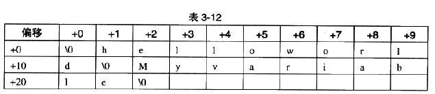

第三章：目标文件里有什么


- 3.1 目标文件的格式

    目标文件就是源代码编译后但未进行链接的那些中间文件，与可执行文件的内容和结构很相似，所以一般跟可执行文件格式一起采用同一个格式存储。`动态链接库（Windows中的.dll和Linux中的.so（share object））以及静态链接库（Windows的.lib和Linux的.a（archive，别名static library））文件都按照可执行文件格式存储。`

    - 核心转储文件（Core Dump File）：当进程意外终止时，系统可以将该进程的地址空间的内容及终止时的一些其他信息转储到核心转储文件（ELF文件类型）

- 3.2 目标文件是怎样的

    - `目标文件的内容至少有编译后的机器指令代码、数据，还包括链接所需的信息如符号表、调试信心、字符串等。一般目标文件将这些信息按照不同的属性，以“节”（Section）的形式存储，有时也叫“段”（Segment）。`它们均表示一个一定长度的区域，基本上区别不大。`（两者区别是在ELF文件的链接image和装载image的时候（第6章？）。`

    - 程序源代码被编译后主要分成两种段：`程序指令（代码段）和程序数据（数据段、.bss段）`，两者分开放的优点：
        1. 数据和指令被映射到两个虚存区域。两个的读写权限的差异可防止程序的指令被有意/无意地修改。
        2. 现在CPU有强大的缓存体系。为了提高缓存的命中率，指令缓存和数据缓存的分离利于提高程序的局部性。
        3. 当系统运行多个相同程序的副本时，它们的指令都是一样的，所有内存只需要保存一份该程序的指令部分即可。（使用的场景有：图标、图片、文件等，特别在有动态库的系统可节约大量内存，`内存共享的更多内容在装载章节（第六章）中有更详细的分析`）

    -  代码段（Code Section）（".code"或".text"）：存放编译后的机器指令
    -  数据段（Data Section）（".data"）：已初始化的全局变量、局部静态变量
    -  （Block Started by Symbol）".bss"： 未初始化的全局变量、局部静态变量(因为未初始化的全局变量和局部静态变量的值为0，所以为它们在.data段分配空间且存放数据0是没有必要的，但程序运行时它们确实需要占内存空间，所以`.bss段`只是为那些未初始化的全局变量和局部静态变量预留位置，它并没有内容，所以他`在文件中也不占据空间`)


    - 
        
        - 如上图：
            1. ELF文件开头是一个“文件头”，它描述整个文件的属性（是否可执行、如果是可执行类型的入口地址、静态链接还是动态链接、目标硬件、目标操作系统等信息），`文件头还包括一个段表（Section Table）(一个数组，描述文件中各个段所有信息，包括文件中各个端在文件中的偏移位置以及段属性)`
            2. 文件头后面就是各个段的内容，如代码段、数据段等等

- 3.3 挖掘SimpleSection.o

    - 

    - GCC编译文件得到.o文件：$gcc -c SimpleSection.c
    - 使用binutils的工具objdump查看object内部结构：objdump -h SimpleSection.0（详细用法使用man）
    - 发现除了基本的段外，还有只读数据段(.rodata)、注释信息段（.comment）、堆栈提示段(.note.GNU-static)。
    - 查看文件的代码段、数据段、BSS段的长度：size SimpleSection.o

    
    - 3.3.2 数据段和只读数据段

        - .data段保存已初始化的全局静态变量和局部静态变量。
        - .rodata保存只读数据，一般是程序的只读变量（const 修饰的变量）的字符串常量。单独设立此段的优点：不光在语义上支持C++的const关键字，而且操作系统在加载的时候可以将".rodata"段的属性映射为只读，限制被修改，保证程序安全。（有时候编译器会把字符串常量放到".data"段）


    - 3.3.3 BSS段
        存放未初始化的全局变量和局部静态变量。 

    - 3.3.4 其他段
        

        - `自定义段：为了满足某些特定的功能，如某些硬件的内存和I/O地址布局，或向Linux操作系统内核中用来完成一些初始化和用户空间复制时出现页错误异常等，GCC提供一个扩展机制，使得程序员可以指定变量所处的段。（自定义段的名字不能使用"."作为前缀，避免与系统保留段名冲突。）`
            - `__attribute__((sectino("FOO"))) int global = 42;`
            - `__attribute__((secion("BAR"))) void foo() {}`
            - 我们在全局变量或函数之前加上"__attribute__((section("name")))"属性即可把相应的变量或函数放到以"name"作为段名的段中。


- 3.4 ELF文件结构描述

    - 

    - 文件头包含描述整个文件的基本属性，最重要的结构如上图。

    - 3.4.1 文件头
        
        - readelf命令可以详细查看ELF文件：$readelf -b SimpleSection.o
        - ELF文件头定义了`ELF魔数（用于识别文件的类型）、文件机器字节长度、数据存储方式、版本、运行平台、ABI版本、ELF重定位类型、硬件平台、硬件平台版本、入口地址、程序头入口和长度、段表的位置和长度及段的数量`等。

    - 3.4.2 段表（Section Header Table）
        
        放置段的基本属性，描述看ELF各个段的信息（段名、段的长度、在文件的偏移、读写权限及其他属性）。段中的部分字段还涉及到一些`映像文件的加载的概念`。

    - 3.4.3 重定位表

        链接器在处理目标文件时，需要对目标文件的某些部分进行重定位，即代码段和数据段中那些能够对绝对地址的引用的位置。而这些重定位的信息都记录在ELF文件的重定位表中，每个需要重定位的代码段或者数据段，都有一个对应的重定位表。

    - 3.4.4 字符串表

        - 
        - 使用便宜来引用字符串


- 3.5 链接的接口---符号 

    链接的本质是将不同的目标文件相互“粘”在一起，在链接中，目标文件值得这种相互拼合实际上是目标文件的之间对地址的引用，即对函数和变量的地址的引用。`函数和变量统称为符号（Symbol）`，符号名和变量名就是符号名（Symbol Name）。

    链接过程很关键的一部分就是符号的管理，每一个目标文件都会有一个对应的`符号表（Symbol Table）`，表中记录了目标文件中所用到的所有符号，每个符号对应一个值，叫做符号值（Symbol Value)，与变量和函数而言符号值就是它们的地址。

    - 除了变量和函数外，符号一般还有：
        1. 定义在本目标文件的全局符号，可被其他目标文件引用
        2. 在本目标文件引用的全局符号，却没有定义在本目标文件，一般叫做外部符号（External Symbol） 
        3. 段名，这种符号由编译器产生，其值为段的起始地址。
        4. 局部符号，基在编译单元内部可见。调试器可使用这些符号来分析程序和崩溃时的核心转储文件，这些局部符号对于连接过程无作用，链接器往往忽略它们。
        5. 行号信息，即目标文件指令和源代码中代码行的对应关系

        - 可使用nm命令查看符号：$ nm SimpleSection.o


    - 3.5.1 ELF符号表结构

        - 关于符号值的区分：
	        1. 在目标文件中，如果是符号的定义并且为非“COMMON块”类型的（COMMON块参照第四章），则符号值表示该符号在段中的偏移。
            2. 若符号是“COMMON块”类型的，符号值为该符号的对齐属性。
            3. 在可执行文件中，符号值表示符号的虚拟地址。这个虚拟地址对于动态链接器来说非常有用。
            
    - 3.5.2 特殊符号

        - 当使用ld作为链接器来链接生产可执行文件时，它会为我们定义很多特殊符号，这些符号并没在程序中定义，而是定义在ld链接器的链接脚本中，但是我们可以直接声明并引用它们。
        
        - 几个代表性的特殊符号：(以下地址均为程序被装载时的虚拟地址。)
            1. __executable_start，程序器起始地址（非程序入口，而是程序最开始的地址）
            2. __etext/_etext/etext，为代码段结束地址
            3. __eddata/eddata，数据段结束地址
            4. _end/end，程序结束地址
            

    - 3.5.3 符号修饰和函数签名
    	为了防止符号冲突、UNIX下的C语言，C语言源代码文件中的所有变量和函数经过编译后，相应的符号名前加上下划线“_”。C++考虑到不同模块之间可能产生的冲突，增加了命名空间（Name Scape）的方法来解决多符号冲突的问题。
	    
        - C++符号修饰：
	        - 面对两个函数名相同，参数列表不同的函数的符号区分(即函数重载)，人们发明了符号修饰（Name Decoration）/符号改变(Name Managling)的机制。

            - 函数签名（Function Signature），包含了一个函数的信息，包括函数名，参数类型，所在的类和名称空间及其他信息。

      
    - 3.5.4 extern "C"
        
        - C++ 为了与C兼容，在符号的管理上，C++有一个用于声明或定义一个C的符号的"extern "C""关键字法

            ```
                extern "C {
                    int func(int);
                    int var;
                }
            ```

            - `C++编译器会将extern "C"的大括号内部的代码当作C语言代码处理。`

        - 也可以单独声明某个函数或变量为C语言的符号，也可以使用下面格式：
            - extern "C" int func(int);
            - extern "C" int var;

        
        - `C语言不支持"extern "C""语法，为了兼容C和C++语言，使用C++的宏"__cplusplus"能解决这个问题，C++编译器会在编译C++程序时默认定义这个宏，我们可以使用条件宏判断当前编译单元是否为C++代码。`这是非常有用的技巧。
            - [C++条件宏](C++条件宏.png)


    - 3.5.5 弱符号与强符号

        在多个目标文件如果存在强符号的重复定义，那么链接时会报错。对于C/C++语言，编译器默认函数和初始化了的全局变量为强符号，未初始化的全局变量为弱符号。也可以通过GCC的"__attribute__((weak))"定义任何一个强符号为弱符号。需要注意的是，强符号和弱符号是针对定义来说的，而不是针对符号的引用。
        
        - 针对强若符号的概念，链接器按如下规则处理与选择被多次定义的全局符号：
            1. 不允许强符号被多次定义
            2. 如果一个符号在某个目标文件中是强符号，在其他文件中都是弱符号，那么选择强符号。
            3. 如果一个符号在所有目标文件中都是弱符号，那么选择其中占用空间最大的一个。

        - 弱引用和强引用：强引用与弱引用主要用于库的链接过程，在处理强引用时，如果在链接时，没有被正确决议（绑定），找不到符号的定义，则链接器会报符号未定义的错误。而弱引用则不认为这是种错误而是默认其为0或一个特殊的值，便于程序代码能识别。
       	
        - 弱符号和弱引用对库来说非常有用，如库中定义的弱符号可以被用户定义的强符号引用所覆盖，从而使程序可以使用自定义版本的库函数，或者程序可对某些扩展功能膜扩的引用定义为弱引用，当将扩展模块和程序链接在一起时，功能模块能正常使用，去掉某些功能模块，程序也能正常链接，这种操作是的程序的功能更加容易剪裁和组合。

        
- 3.6 调试信息
    - 现代编译器几乎都支持源码级别的调试，比如断点、单步行进等等，当然前提是目标文件中包含了源代码与目标函数之间的关系（如：目标文件的地址对应源代码的行号、函数和变量的类型，字符串等）
    
    - 调试信息在目标文件和可执行文件中占用很大的空间，往往比程序的代码和数据本身大好几倍。


- 总结
    - 无论是可执行文件、目标文件、库，实际上都是基于段的文件，或者是这种文件的集合。程序的源代码经过编译后，按照代码和数据分别存放到对应的段中，编译器（汇编器）会将一些辅助性的信息（符号、重定位信息）按照表的方式存放到目标文件中。通常情况下，一个表往往就是一个段。