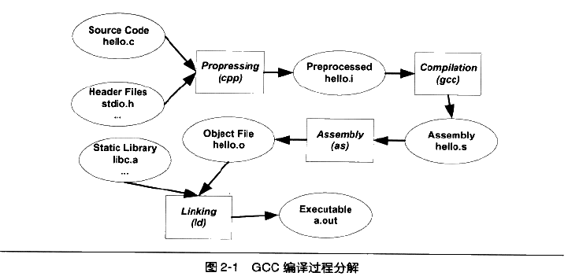
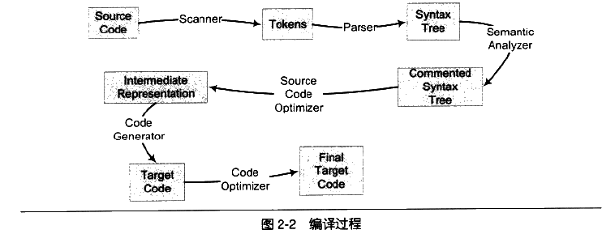
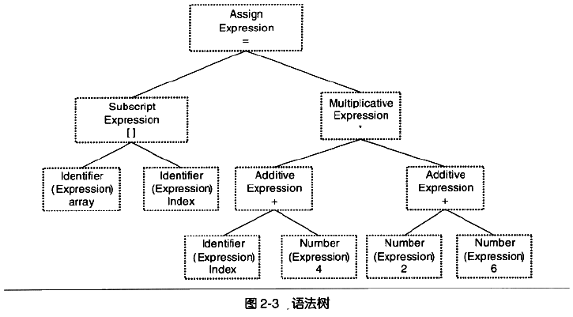
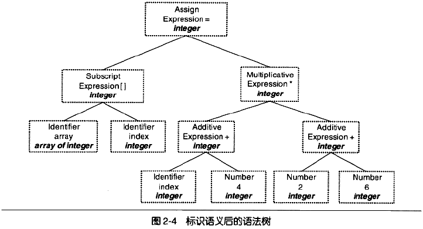
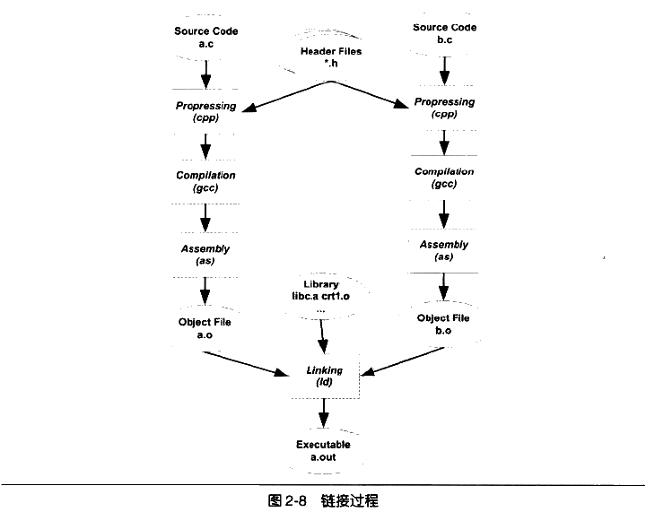

789+6·1

第二章: 静态链接

- 2.1 被隐藏了的过程

    - 使用GCC编译程序:
        1. gcc hello.c     
        2. ./a.out

        - 事实上，上面的过程可以分为四步：预处理、编译、汇编、链接（Preperssing， Compilation，Assembly，Linking）

         
        
    - 2.1.1 预编译

        - 预编译过程相当于：$gcc -E helloc.c -o hello.i     (或者: $cpp hello.c  >  hello.i)
        - 预编译处理规则：
            1. 删除所有#define，展开所有宏定义
            2. 处理所有预编译条件指令（#if、#ifdef、#else等）
            3. 处理#include编译指令 将被包含的文件插入到该预编译指令的位置（这个过程是递归进行的，即被包含的文件还可能包含其他文件）
            4. 删除所有注释
            5. 添加行号和文件名标识，便于编译时编译器产生调试用的行号信息以及用于编译时产生编译错误或警告时能显示行号。（iOS dSYM）
            6. 保留#pragma编译器指令，因为编译器需要使用它们

    - 2.1.2 编译

        编译过程就是将预处理完的文件进行`词法分析、语法分析、语义分析、优化，然后生成对应的汇编代码文件`。

        - 汇编过程相当于：$gcc -S hello.i -o hello.s，当然我们可以将预编译和编译步骤合并起来：$gcc -S hello.c -o hello.s

        - gcc命令实际上是多个后台程序的包装，它会根据不同参数要求去调用对应与预编译、编译程序，ccl、汇编器as、连接器ld等。

    - 2.1.3 汇编

        - 汇编过程基本就是汇编器根据汇编指令和机器指令的对照表意义翻译，没有编译过程复杂。

        - 汇编过程可以使用汇编器as来完成：$as hello.s -o helloc.o（或者：$gcc -c hello.s -o helloc.o），当然也可以直接使用gcc命令从C源代码开始，警告过预编译，编译和汇编输出目标文件（Object File）：$gcc -c hello.c -o hello.o

    - 2.1.4 链接

        我们总是需要将一大堆文件连接起来才可以得到a.out，即最终的可执行文件。在这个过程通常用到链接器

- 2.2 编译器做了什么

    `编译器就是将高级语言翻译成机器语言的工具。`

    

    - 2.2.1 词法分析

        源代码程序被输入到`扫描器（Scanner）`，扫描器仅进行简单的词法分析，运用类似于有限状态机的算法算法，将源代码的字符序列分割成为一系列的记号（Token）。

        - 工作：
            1. 识别记号（如：关键字、标识符、字面量（包含数字、字符串等）、特殊符号（加号、等号））
            2. 将标识符存放到符号表，将数字、字符串常量存放到文字表等。

    - 2.2.1 语法分析

        `语法分析器（Grammer Parser）`将扫描器产生的记号进行语法分析，产生`语法树（Syntax 0Tree）`。整个分析过程使用了`上下文无关语法`（上下文无关文法就是说这个文法中所有的产生式左边只有一个非终结符）。

        `语法树就是以表达式（Expression）为节点的树。`
        

        在语法分析的同时，很多运算符号的优先级和含义也被确定下来。如果出现表达式不合法比如各种括号不匹配，表达式中缺少操作符，编译器就会报告语法分析阶段的错误。

    - 2.2.3 语义分析

        语义分析器（Semantic Analyzer）的分析仅完成了对表达式的语法层面的解析语句是否合法，并不了解这个语句的真正意义。

        编译器仅能分析静态语义（Static Semantic），也就是在编译期可确定的语义。而动态语义（Dynamic Semantic）指的是运行期才能确定的语义。（静态语义包括声明、类型的匹配、类型的转换。动态语义就是运行期出现的语义相关的问题，如将0作为除数就是一个运行期语义错误。）

        经过语义分析后，语法分析阶段产生的`语法树`的表达式(包括符号和数字)都被标记了类型。
        

    - 2.2.4 中间语言生成

        源代码级优化器会在源代码级别上进行优化，如’标识语义后的语法树‘中的（2 + 6）这个表达式可以被优化掉，因为其值编译器就可以被确定。

        源代码级优化器往往将整个语法树转换成中间代码（Intermediate Code），中间代码是语法树的顺序表示，它接近目标代码，但一般与目标机器和运行时环境无关。中间代码的比较常见的有：三地址码和P-代码。

        `中间代码使编译器可以被分为前端和后端`。编译器前端负责产生机器无关的中间代码，编译器后端将中间代码转换为目标机器代码。对于跨平台的编译器而言，他们可以针对不同的平台使用同一个前端和针对不同机器平台的数个后端。

    - 2.2.5 目标代码生成和优化

        `编译器后端主要包括代码生成器（Code Generator）和目标代码优化器（Target Code Optimizer）`。
        
        `代码生成器将中间代码转换为目标机器代码`。整个过程依赖于目标机器，因为不同机器有不同的字长、寄存、整数数据类型和浮点数数据类型等。

        `目标代码优化器对目标代码进行优化`，比如选择合适的寻址方式，使用位移替代乘法运算、删除多余的指令等等。

        
        
    - 一个问题： 目标代码中有变量定义在其他模块是怎么处理的：定义其他模块的全局变量和函数在最终运行时的绝对地址都要在最终链接的时候才能确定，现代编译器可将一个源代码文件编译成一个未链接的目标文件，然后由连接器最终将这些目标文件连接起来形成可执行文件。

- 2.3 链接器的年龄比编译器长

    模块之间的通信问题：其实也就是模块间符号的引用问题。

- 2.4 模块拼装 -- 静态链接

    - 链接：主要内容就是把各个模块之间的相互引用的部分处理好，使得各个模块之间能够正确地衔接。过程主要包括`地址和空间分配）（Address and Stroage Allocation）、符号决议（Symbol Resolution）和重定位（Relocation）`

        - `符号决议也叫符号绑定（Symbol Binding）、名称绑定（Name Binding）、名称决议(Name Resolution)，甚至还有叫地址绑定(Address Binding)、指令绑定（Instruction Binding）。从细节而言“决议”更倾向于静态链接，而“绑定”更倾向于动态链接，他们使用的范围不一样。`

    - 静态链接过程：
        

        每个模块的源代码文件经过编译器编译成（中间目标文件或模块）目标文件（Object File，即.o/.obj文件），目标文件和库一起链接形成最终的可执行文件。常见的库是运行时库（Runtime Library），它是支持程序运行的基本函数的集合。库企是是一组目标文件的包。
    
        举例：程序模块main.c中使用另一模块func.c的函数foo()，我们在main.c模块中都是单独编译的，在编译器编译main.c时必须确切知道foo整个函数的地址，所以它暂时把这些调用foo的指令的目标地址搁置，等待最后链接的时候由链接器将这些指令的目标文件修正。

        链接过程对其他定义在目标文件中的函数调用的指令必须被重新调整。整个地址修正的过程也叫重定位，每个被修正的地方叫做一个重定位入口（Relocation Entry）。

        
