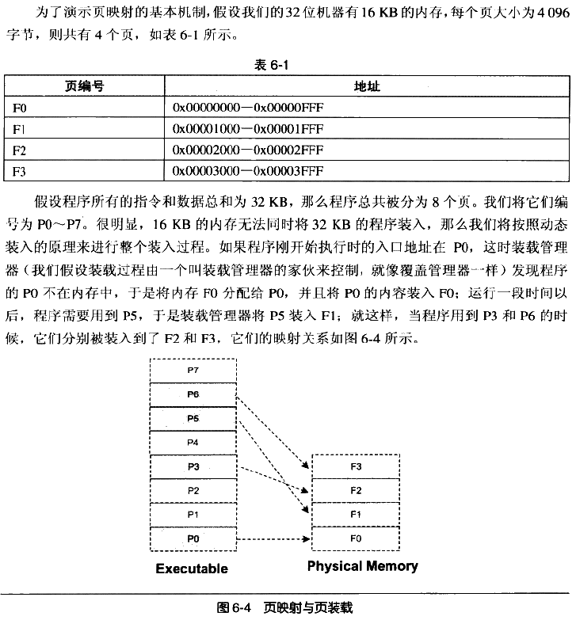
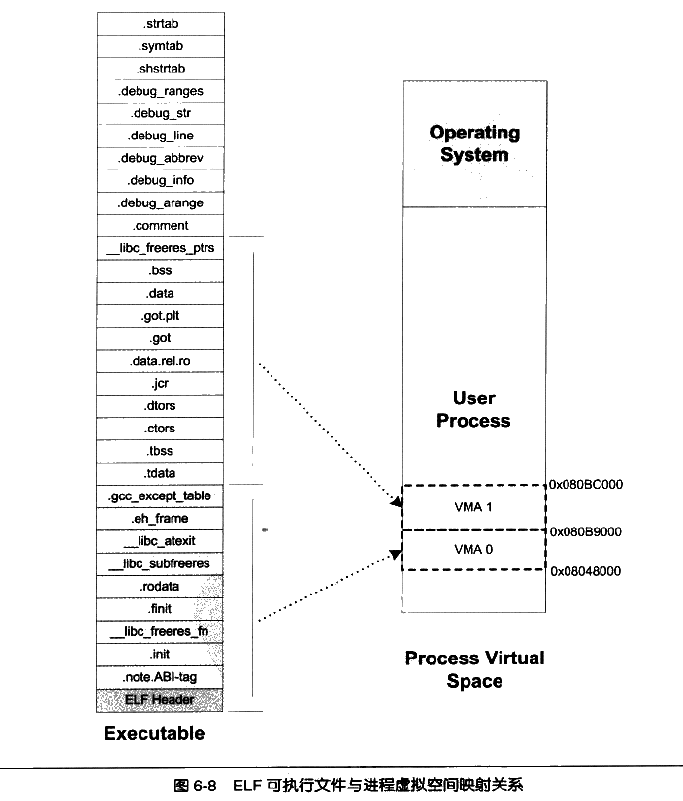
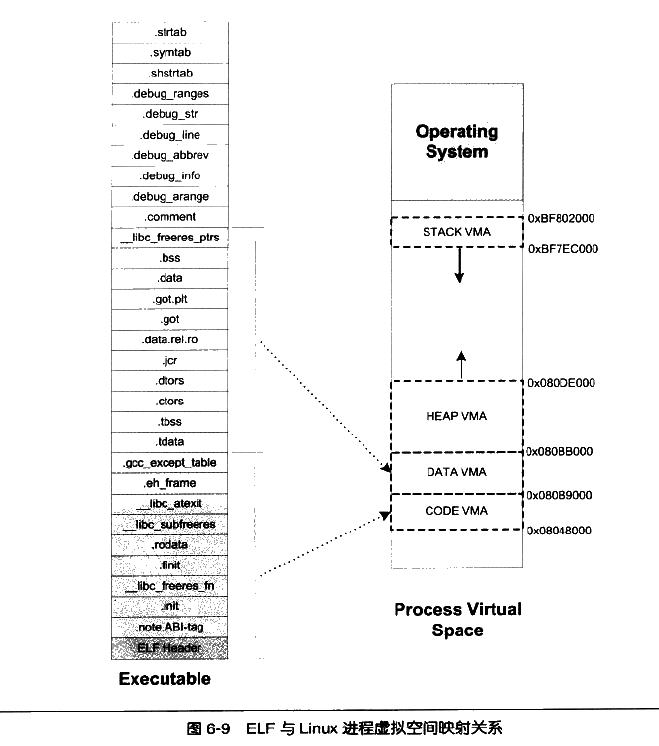

第六章：可执行文件的装载与进程

- 6.1 进程虚拟地址空间

    - 程序与进程：程序（或者侠义上讲的可执行文件）是一个静态的概念，它就是一些预先编译好的指令和数据集合的一个文件；进程则是一个动态的概念，它是程序运行时的一个过程，很多时候吧动态库叫做运行时也有一定的含义。

    - 每个程序被运行起来后，它将拥有自己`独立的虚拟地址空间（Virtual Address Space）`，这个虚拟地址空间的大小由计算机的硬件平台决定，具体地说是由CPU的位数决定的。硬件决定了地址空间的最大理论上限，即硬件的寻址空间大小，如32位的硬件平台决定了虚拟地址空间的地址为0到2的32次方-1，也就是4GB的虚拟地址空间。(虚拟空间的有些页被映射到同一个物理页，这样就可实现内存共享（动态库）)

    - 但是我们的程序并不能任意使用虚拟地址空间，因为`程序运行时处于操作系统的监管下，操作系统为了达到监控程序运行等一系列的目的，进程的虚拟空间都在操作系统的掌握之中。所以进程仅能使用操作系统分配给进程的地址，若访问为未经允许的空间，操作系统就会捕捉到这些访问，将进程的这种访问当作非法操作，强制结束进程。`

    - 每个用户模式进程都有自己的专用虚拟地址空间，但所有以内核模式运行的代码共享一个称为系统空间的虚拟地址空间。用户模式进程的虚拟地址空间称为用户空间。在用户模式下运行的代码可以访问用户空间，但无法访问系统空间。此限制可防止用户模式代码读取或更改受保护的操作系统数据结构。在内核模式下运行的代码可以访问用户空间和系统空间。也就是说，以内核模式运行的代码可以访问系统空间和当前用户模式进程的虚拟地址空间。 

    - PAE：（Physical Address Extension）

        - 在32位操作系统中，只有32位的虚拟地址空间，应用程序如何使用大于常规的内存空间？一个常见的方式就是操作系统提供一个窗口映射的方法，把这些额外的内存映射到进程地址空间中来。应用程序可以根据需要来申请和映射，如一个程序应用中0x10000000~0x20000000这一段256MB的虚拟地址空间用来做窗口，程序可以从高于4GB的物理空间中申请多个大小为256MB的物理空间，编号成A、B、C等，然后根据需要将这个窗口映射到不同的物理空间块，用到A时将0x10000000~0x20000000映射到A，用到B、C时再映射过去，如此重复操作即可。再Windows下，这种访问内存的操作方式叫做AWE(Address Windowing Extensions)；而像Linux等UNIX类操作系统等采用mmap()系统调用来实现。

        
- 6.2 装载的方式

    - 在很多情况下，程序所需要的内存数量大于物理内存的数量，当内存的数量不够时，根本的解决办法就是添加内存。由于内存的昂贵，所以人们想尽办法，希望能在不添加内存的情况下让更多程序运行起来，尽可能有效地利用内存。后来研究发现，程序运行时是有局部性原理地，所以我们可以将程序最常用地部分驻留在内存中，而将一些不太常用地数据存放在磁盘中，这就是动态装入地基本原理。

    - 6.2.1 覆盖装入（Overlay）和页映射（Paging）是两种典型地动态装载方法，它们采用地思想差不多，都是利用程序地局部性原理。

        - 覆盖装入在没发明虚拟存储前比较广泛，现在基本淘汰了。它把挖掘内存潜力地任务交给了程序员，程序员在编写程序时必须手工将程序分割成若干块，然后编写一个辅助代码（覆盖管理器（Overlay Manager））来管理这些模块何时应该驻留内存而何时应该被替换掉。

    - 6.2.2 页映射

        - 页映射是虚拟存储机制地一部分，它随着虚拟存储地发明而诞生。页映射将内存和所有磁盘中地数据和指令按照“页（Page）”为单位划分成若干个页，以后所有的装载和操作的单位就是页。

        

        

- 6.3 从操作系统角度看可执行文件的装载

    从页映射的动态装入的方式上看，可执行文件中的页可能被装入内存的任意页。如果程序使用物理地址直接进行操作，那么每次页被装入时都需要进行重定位。

    - 6.3.1 进程的建立

        - 创建一个进程，然后装载相应的可执行文件并且执行，再有虚拟存储情况下，这个过程最开始只需要做三件事：
            1. 创建一个独立的虚拟地址空间
                - 一个虚拟空间由一组页映射函数将虚拟空间的各个页映射至相应的物理空间，创建一个虚拟空间并不是创建空间而是`创建映射函数所需要的相应的数据结构`，在i386的Linux下，创建虚拟地址空间实际上只是分配一个页目录（Page Directory）就可以了，甚至不设置页映射关系，这些映射关系等到后面程序发生页错误的时候再进行设置。（`页映射关系函数是虚拟空间到物理内存的映射关系`）
            2. 读取可执行文件头，并且建立虚拟空间与可执行文件的映射关系
                - 这一步做的是虚拟空间与可执行文件的映射关系当程序发生页错误时，操作系统将从物理内存中分配一个物理页，然后将该“缺页”从磁盘中读取到内存中，再设置缺页的虚拟页和物理页的映射关系，这样程序才得以正常运行。很明显，`当操作系统捕获到缺页错误时，它应知道程序当前所需要的页位于可执行文件中的哪个位置。这就是虚拟空间与可执行文件之间的映射关系`。从某种角度，这也是整个装载过程最重要的一部，也是传统意义上“装载”的过程。

                - 由于可执行文件在装载时实际上是被映射的虚拟空间，所以可执行文件很多时候又被叫做映像文件（Image）。

                - Linux将进程虚拟空间中的一个段叫做`虚拟内存区域（Virtual Memory Area）`，再Windows中叫虚拟段（Virtual Section）。用于保存可执行文件与可执行文件进程的虚拟空间的映射关系。当程序执行发生页错误时，可以通过查找这样一个数据结构来定位错误页在可执行文件中的位置。

            3. 将CPU的指令寄存器设置成可执行文件的入口地址，启动运行
                - 操作系统通过设置CPU的指令寄存器将控制权交给进程，由此进程开始执行。其涉及内核堆栈和用户堆栈的切换、CPU运行权限的切换。

    - 6.3.2 页错误

        当CPU开始执行某个地址的指令时，发现地址所在页面是个空页面，于是它就认为这是一个页错误（Page Fault）。CPU将控制权交给操作系统，操作系统有专门的页错误处理例程处理这种情况，即通过查询段对应的VMA来定位错误页在可执行文件中的位置（偏移），然后将控制权还给进程，进程从刚才页错误的定位冲顶开始执行。

- 6.4 进程虚拟空间分布
    - 6.4.1 ELF文件链接视图与执行视图

        - `ELF可执行文件引入了一个概念叫做“Segment”，一个Segment包含一个或多个属性类似的Section。`一般是将上面提到的段权限相同的段，在装载时，链接器尽量把相同权限属性的段分配在同一空间，把它们看作是一个整体一起映射，也就是说映射以后在进程虚拟空间中只有一个相对应的VMA，而不是两个，这样的好处是可以明显地较少页面内部碎片，从而节省了内存空间。

        - 从链接角度看，ELF文件是按照“Section”存储地；从装载角度看，“Segment”重新划分了ELF地各个段（相同权限属性的连在一起的段看作同一整体）。系统是按照“Segment”来映射可执行文件的。

        - Segment和Section两者是从不同角度来划分同一个ELF文件。这个在ELF中被称为不同的视图（View）,从Segment角度看就是链接视图（Linking View），Segment角度看就是执行视图（Execution View）。
        

        - ELF可执行文件中有一个专门的数据结构叫做程序头表（Program Header Table）用于保存Segment的信息，这是一个结构体数组。

        

    - 6.4.2 堆和栈
        - VMA除了被用来映射可指定文件的各个Segment外，操作系统通过使用VMA（Virtual Memory Area）来对进程的地址空间进行管理。事实上，进程的堆和栈在进程的虚拟空间中的表现也是以VMA的形式存在的，很多情况下，一个进程中的堆和栈分别都有一个对应的VMA。

        - [主设备号和次设备号](https://blog.csdn.net/liangkaiming/article/details/6234238)

        - C语言中的malloc内存分配函数就是堆里面分配的，堆由系统库管理。另外有一个特殊的VMA叫vdso，它的地址位于内核空间，是一个内核的模块，进程可以通过访问这个VMA来跟内核进行一些通信。

        - 总结：
            - 操作系统通过给进程空间划分出一个个VMA来管理进程的虚拟空间；基本原则是将相同权限属性的、有相同映像文件的映射成一个VMA；一个进程基本可以分为如下几种VMA区域：
                1. 代码VMA，权限只读，可执行；有映像文件。
                2. 数据VMA，权限可读写，可执行；有映像文件
                3. 堆VMA，权限可读写，可执行；无映像文件，匿名，可向上扩展
                4. 栈VMA，权限可读写，不可执行；无映像文件，匿名，可向下扩展
            

    - 6.4.4 段地址对齐

        可执行文件最终要被系统装载运行，这个装载过程一般是通过虚拟内存的页映射机制完成的。在映射过程中，页是映射的最小单位。

    - 6.4.5 进程栈初始化

        操作系统在进程启动前将系统环境变量和进程的运行参数提前保存到进程的虚拟空间的栈中（Stack VMA）。

    
- 6.5 Linux内核装载ELF过程简介

    - 每种可执行文件的格式的开头几个字符都是很特殊的，特别是开头4个字节，常常被称为魔数（Magic Number），通过都魔数的判断可以确定文件的格式和类型。

- 6.6 Windows PE的装载

    
- 6.7 总结

    1. 操作系统如何被装载到内存中进行运行
    2. 为什么要以页映射的方式将程序映射到进程地址空间，好处是什么
    3. 进程如何被建立，程序开始运行时发生页错误的处理方式

    

        
