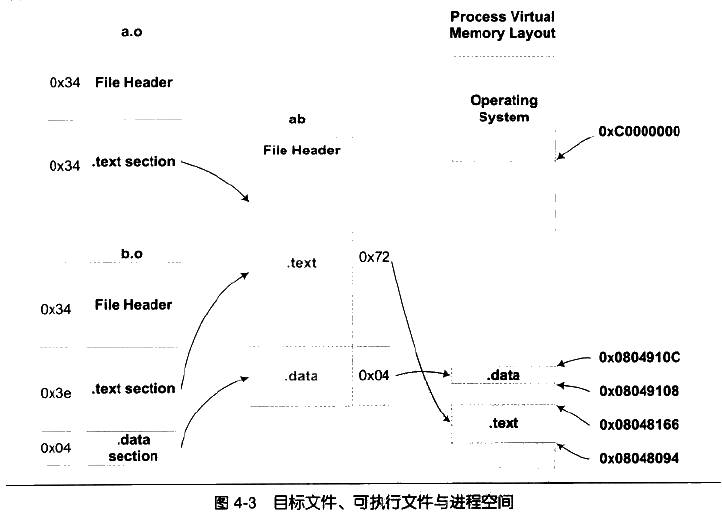

第四章：静态链接

- 4.1 空间和地址分配

    于链接器而言，链接过程就是将输入目标文件加工后合并成一个输出文件。可执行文件中的代码段和数据段由输入的目标文件合并而来。那么存在一个问题，对于多个输入目标文件，链接器如何将它们的各个段合并到输出文件？或者说输出文件中和空间如何分配给输入文件？

    - 4.1.1 按序叠加：按次序叠加起来，但会使最终输出文件有很多零散的段。

    - 4.1.2 相似段合并：将所有性质相同的段合并到一起。如将所有的目标文件的.text合并到输出文件的.text段。

        - 链接器为目标文件分配地址和空间，这句话的“地址和空间”有两个含义：
            1. 在输出的可执行文件中的空间
            2. 装载后的虚拟地址中的虚拟地址空间

            对于.text、.data而言，它们在文件中和虚拟地址中都要分配空间，因为它们在这两者中都存在；而对于.bss来说，分配空间的意义只局限于虚拟地址空间，因为它在文件中并无内容。事实上，我们这里谈到的空间分配仅关注于虚拟地址空间的分配。因为这个关系到后面的关于地址计算的步骤，而可执行文件本身的空间分配和链接过程关系并不大。（可关注：可执行文件的装载与进程）

        - 现在链接器空间分配的策略基本都采用上面第二种方法，这种方法一般采用两步链接(Twp-pass Linking)方法：
            1. 空间与地址分配：扫描所有的输入目标文件，并且获取它们的各个段的长度、属性和位置，将输入目标文件中的符号表中的所有符号定义和符号引用收集起来，统一放到一个全局符号表。此步骤将所有段合并，计算出输出文件中各个段合并后的长度与位置，并建立映射关系。 

            2. 符号解析与重定位：收集第一步的所有信息，读取输入文件中段的数据、重定位信息，进行符号解析与重定位、调整代码中的地址等。（VMA：virtual memory address，虚拟地址。LMA表示load memory address，加载地址）(可关注：可执行文件的装载与进程）

         
        
         

- 4.2 符号解析与重定位

    - 4.2.1 重定位：对目标文件而言就是修正外部符号的地址（虚拟地址）

    - 4.2.2 重定位表（Relocation RTable）

        重定位表是专门用来保存与重定位相关的信息的结构，用于描述如何修改相应的段里的内容。每个要被重定位的ELF段都有一个对应的重定位表，而一个重定位表往往就是ELF中的一个段，重定位表也叫重定位段。如代码段.text如有要被重定位的地方，那么就会有一个对应叫做.rel.text的段保存了代码段的重定位表。（使用objdump查看重定位表： $ objdump -r xxx.o）

        每个要被重定位的地方叫做一个重定位入口(Relocation Entry)，重定位入口的偏移（Offset）表示该入口在要被重定位的段中的位置。

    - 4.2.3 符号解析

        在重定位表中包含未定义的符号的信息。在链接器扫描完所有的输入目标文件之后，未定义的符号应该都能在全局符号表中找到，否则链接器就报符号未定义的错误。

    - 4.2.4 指令修正方式

        

- 4.3 COMMON块

    - 弱符号机制允许同一符号的定义存在于多个文件中，所以可能会导致一个问题：如果一个弱符号定义在多个目标文件中，而它们的类型又不一致的情况。
        - 情况主要分为：
            1. 两个或两个以上强符号类型不一致-------非法情况、链接器报错
            2. 有一个强符号，其他都是弱符号，出现类型不一致-------
            3. 两个或两个以上弱符号类型不一致-------

    - 现代编译器和链接器都支持一种叫做COMMON块（Common Block）的机制。当不同的目标文件需要的Common块空间大小不一致时，以最大的那块为准。链接器在处理弱符号时，就是使用与COMMON块一样的机制。值得注意的是，如果链接过程中两个相同符号，有弱符号大小大于强符号，ld链接器就会发出警告。

    - 这也解释了编译器为什么不直接二把未初始化的全局变量也当作未初始化的局部静态变量一样处理，为它们在目标文件的BSS段中分配空间，而是将其标记为一个COMMON类型的变量。（就是因为其他目标文件也可能定义了相同的弱符号（未初始化的全局变量就是典型的弱符号），那么该弱符号最终所占空间的大小是未知的，需要链接器读取完所有输入目标文件后，所有弱符号的大小都确定，因此在最终输出文件的BSS段中为它们分配空间。）

- 4.4 C++相关问题

    - 4.4.1 消除重复代码

        - 函数级别链接：GCC的"-ffunction-sections"、"-fdata-sections"将每个函数或变量分别保持在独立的段中，当链接器需要用到某个函数时，它就将这个函数合并到输出文件中，对于那些没用到的函数则将它们抛弃。

    - 4.4.2 全局构造与析构

        - 程序的一些特定操作必须在main函数之前被执行，还有一些操作必须在main函数之后被执行，如C++的全局对象的构造和析构函数。因此ELF文件中还定义了两种特殊的段。
            1. .init段保存的是可执行指令，构成了进程的初始化代码，当一个程序开始运行时，在main函数调用前，Glibc的初始化部分安排执行这个段中的代码。
            2. .init段保存进程终止代码指令，当一个程序正常退出时，Glibc会安排执行这个段中的代码。

    - 4.4.3 ABI

        ABI：符号修饰标注、变量布局、函数调用方式等与可执行代码二进制兼容相关的内容。

    

- 4.5 静态库链接

    人们通常使用"ar"压缩程序将一些目标文件压缩到一起，并且对其进行编号和索引，以便于查找和检索，就形成了lib.a这个静态库文件。(可以使用"ar"工具查看具体包含的目标文件：$ar -t libc.a)

- 4.8 总结
    
    目标文件在被链接成最终可执行文件时，输入目标文件中的各个段是如何被合并到输出文件中的，链接器如何为它们分配在输出文件中的空间和地址。一旦输入端的最终地址被确定，接下来就可以进行符号的解析与重定位，链接器会把各个输入目标文件中对于外部符号的引用进行解析，把每个段中需要重定位的指令和数据进行“修补”，是它们都指向正确的位置。
